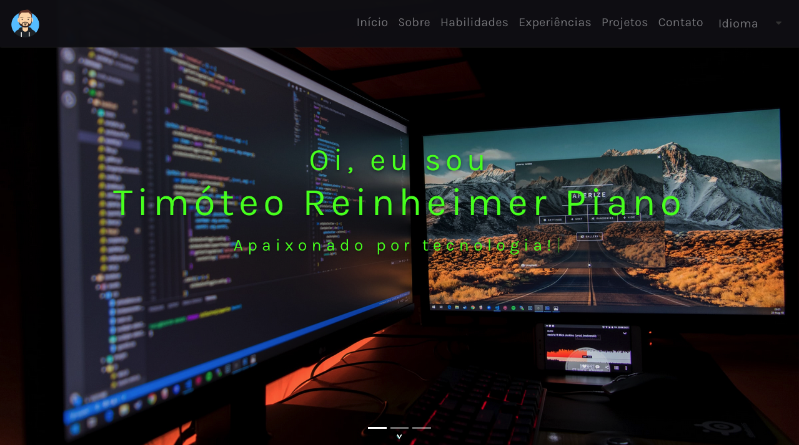

<div align="center" id="top"> 
  
</div>

<hr/>
<br>

## About

This applications is an personal portfolio.

## Screenshots

<div align="center" id="top"> 
  
</div>
<br/>

## Features

- List all technologies known to different categories.
- List the projects worked on, which technologies were used, the existing features in each project.

## Technologies

The following tools were used in this project:

- [React](https://pt-br.reactjs.org/)
- [React-BootStrap](https://react-bootstrap.github.io)
- [Styled Componensts](https://styled-components.com/)

## Requirements

Before starting 🏁, you need to have [Git](https://git-scm.com) and [Node](https://nodejs.org/en/) installed.

## Starting

```bash
# Clone this project
$ git clone https://github.com/trpiano/reactfolio

# Access
$ cd reactfolio

# Install dependencies
$ yarn
# Or
$ npm

# Run the project
$ yarn dev
# Or
$ npm start

# The server will initialize in the <http://localhost:3000>
```

Made with 💜 by <a href="https://github.com/trpiano" target="_blank">Timoteo Piano</a>

&#xa0;

<a href="#top">Back to top</a>
